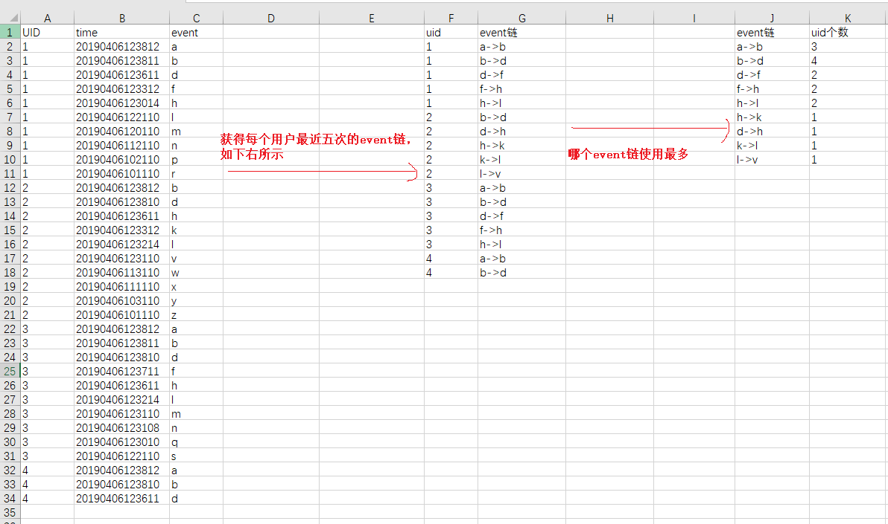

# Hive试题汇总\(1-10\)

## 试题一：求单月金额和截止当月的总金额

| ID | Month | amoun | result |
| :--- | :--- | :--- | :--- |
| 1 | 1 | 20 | 20 |
| 1 | 2 | 30 | 50 |
| 1 | 3 | 40 | 110 |
| 2 | 1 | 20 | 20 |
| 2 | 2 | 30 | 50 |
| 2 | 3 | 40 | 110 |

考察知识点：Hive窗口函数：SUM

追加：要求最多统计12个月的

考察知识点：RANGE/PRECEDING 

解题SQL：



```sql
SELECT
id
month,
SUM(amoun) OVER(PARTITION BY id ORDER BY month) AS result
FROM
uaccess
```



## 试题二：获得每个用户最近五次的event链并给出哪个event链使用最多



考察函数：ROW\_NUMBER\(\) OVER /  CONTACT/ LEAD\(\) OVER\(\)

#### 解题代码



```sql
select 
c_event,
count(1) as c
from (
select 
userid,
time,
row_number() over(partition by userid order by time desc) as n,
concat(event,'->',LEAD(event,1) over(partition by userid order by time desc) ) as c_event
from userevent ) as t where c_event is not null 
group by c_event
order by c
desc 
limit 5
```



